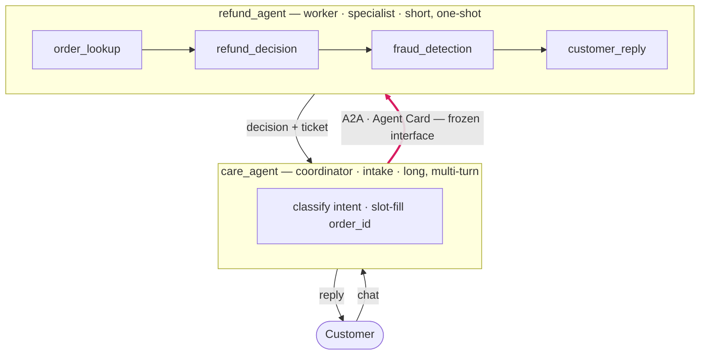

# Agentic AI POC — Customer Care Operations

A two-agent customer-service system built with **Google ADK** and **A2A**. A
conversational coordinator handles the customer; when the topic turns to a refund,
it delegates to an independent specialist worker.

## 1. What's in this project

Three pieces of engineering, each with its own deep-dive page:

| # | Content | What it is |
|---|---------|------------|
| 0 | [**Harness operating models**](docs/harness-operating-models.md) | Architecture decision guide: **composable runtime** versus **integrated agent platform** |
| 1 | [**Application-level harness — Cloud Run**](docs/harness-cloud-run.md) | Cloud Run gives **only cloud scaling** — the app **composes** sessions, memory, tracing, and PII guardrails from code plus external managed services |
| 2 | [**Platform-level harness — Agent Engine**](docs/harness-agent-platform.md) | Vertex Agent Engine (the **Gemini Enterprise Agent Platform**) **includes the harness and governance** — managed sessions, tracing, and org-scale policy |
| 3 | [**Evaluation loop**](docs/eval-loop.md) | how you know the system is correct (golden checks + LLM-as-judge; a release gate and a data flywheel) |

Items 1 and 2 are the **same agent logic operated two ways** — see the
[operating-model decision guide](docs/harness-operating-models.md) for the shared
responsibilities and trade-offs.

## 2. Architecture

Two agents, each deployable as its own container, talking over A2A:



- [`customer-care-agent/`](customer-care-agent/) — **coordinator / intake**; long,
  multi-turn. Greets, classifies intent, slot-fills, and **delegates** refunds.
- [`refund-agent/`](refund-agent/) — **worker / specialist**; short, one-shot. Runs
  `order_lookup → refund_decision → fraud_detection → customer_reply`.

Key properties:

- **A2A is a frozen interface.** The coordinator sends an `order_id` and gets back a
  decision; the worker is a black box behind an Agent Card, versioned and scaled on
  its own.
- **The coordinator never decides refunds.** Policy (approve / escalate / reject,
  fraud rules, SLA) lives in the worker.
- **Authored once.** Each agent's policy is a Claude Code `SKILL.md` copied
  byte-identical into ADK; Python holds only host wiring (tools, memory, the A2A
  hookup) — never business logic.

## 3. Harness & governance — built two ways

**Harness** is the runtime scaffolding (sessions, state, memory, tools, tracing);
**governance** is the controls (PII guardrails, policies, audit, identity). These
concerns are **assigned by role**, not copied onto both agents — which is what
makes the coordinator differ from the worker:

| Concern | Care (intake) | Refund (worker) | Interface form |
|---------|:-------------:|:---------------:|----------------|
| Tracing | ✅ its slice | ✅ its slice | export pipe |
| PII guardrail | ✅ **first line** | ◐ defense-in-depth | injected logic |
| Memory (returning customer) | ✅ | ❌ *stateless worker* | service ref |
| Session / state (slot-filling) | ✅ heavy | ◐ minimal | service ref |

The read-off: **memory and heavy state land on the coordinator only** — the worker
is short and stateless.

That same harness is then built **two ways**. Both are **deployed and verified**;
the two pages are the deep dive:

| | ① [**Cloud Run**](docs/harness-cloud-run.md) (application-level) | ② [**Agent Engine**](docs/harness-agent-platform.md) (platform-managed) |
|---|---|---|
| Who provides the harness | **you build it** in the app | **the platform provides it** |
| Container · serve · tracing | you write them (`Dockerfile`, `serve.py`, OTel) | `adk deploy` generates them; tracing is a flag |
| Trade-off | runs **anywhere** (portable) | **org-wide** enforcement (platform-only) |
| Status | ✅ 2 services, real A2A / HTTPS | ✅ `stream_query` verified |

For a **single agent**, the app can do everything the platform does — Cloud Run is
the more fundamental layer. The platform's real exclusives are all **cross-agent /
org-scale**: registry and discovery, org-wide non-bypassable governance,
multi-tenant identity, cross-agent audit — things one app cannot provide *for other
agents*.

## 4. The evaluation loop

The [**evaluation loop**](docs/eval-loop.md) runs on localhost, end-to-end across
both agents, and pinpoints **which agent** failed on **two axes**: **trajectory**
(care — did it route without self-deciding?) and **outcome** (refund — the right
decision *and* an honest reply?).

The idea worth the click: **a golden-set match is an assertion, not a judge.** An
**LLM-as-judge** is needed only where free text can hallucinate — a reply that
promises an approval the customer never got. The suite proves it: one case flips
**PASS → FAIL** only once the real model (`gemini-2.5-flash`) is switched on,
catching what the offline check misses.

The loop has **two jobs**: a pre-deploy **regression gate** and a post-deploy
**data flywheel** (real traffic → human-in-the-loop → new golden → better agents).

## 5. Run locally

```bash
# terminal 1 — refund A2A server (start first; care needs its Agent Card)
cd refund-agent/adk_refund
.venv/bin/uvicorn a2a_server:a2a_app --host localhost --port 8043

# terminal 2 — care coordinator playground
cd customer-care-agent/adk_care
.venv/bin/adk web --port 8042 .
```

In the coordinator UI: `I want my money back` → give `order 67890` → open
**Events / Traces** and watch `transfer_to_agent("refund_agent")` fire the A2A
call. The evaluation suite runs standalone:

```bash
python3 eval/run_eval.py            # offline; add --live-judge for the real model
```

## 6. Status

Worker: ✅ built, traced, guarded, deployed (Cloud Run + Agent Engine).
Coordinator: ✅ routing · slot-filling · A2A handoff · memory · session/state.
Evaluation: ✅ end-to-end loop, two axes, golden + LLM-as-judge.
Next: live judge + human-in-the-loop, context management for long conversations,
and distributed tracing across the A2A hop.
