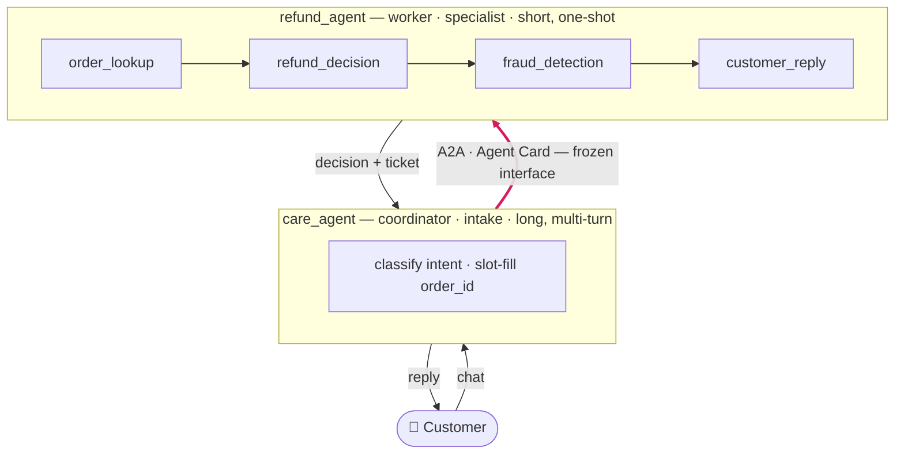

# Customer Care Multi-Agent System

*An MVP two-agent solution (**Google ADK** + **A2A**) — prototyped as **Claude Code
skills**, run with a full **harness & governance** layer (built two ways:
**application-level** on Cloud Run and **platform-managed** on Vertex Agent
Engine), and proven with an **evaluation loop**.*

> ## ▶ The point — the engineering lives in three deep dives
> Beyond a working two-agent system, the parts an interviewer digs into are three
> pages. Same agents, same policy throughout:
>
> **How you run it — the *same* harness, built two ways** (who provides sessions,
> memory, tracing & governance):
> ### ① [Application-level — on Cloud Run](docs/harness-cloud-run.md) → *you build the harness*
> ### ② [Platform-managed — on Agent Engine](docs/harness-agent-platform.md) → *the platform provides it*
>
> **How you know it's correct — the evaluation loop:**
> ### ③ [Evaluation loop & data flywheel](docs/eval-loop.md) → *golden set + LLM-as-judge; a pre-deploy regression gate that becomes a production flywheel*
>
> **These three are the value. Everything below is the context that makes them land.**

An **agent system**, not a single agent: a conversational **coordinator** that
takes the customer intake and, when the topic turns to a refund, delegates to an
independent **specialist worker** over the A2A protocol. This mirrors the
Gemini-Enterprise / Agentspace pattern — a front door that dispatches to
registered specialists.

Three questions an interviewer asks, three sections:

---

## 1 · The solution — *what it does*



*The A2A hop (bold) is the frozen interface: the coordinator sends an `order_id`,
the worker returns a decision — the 4-stage pipeline stays hidden behind it.*

| Agent | Role | Session shape | Job |
|-------|------|---------------|-----|
| [`customer-care-agent/`](customer-care-agent/) | **coordinator** · intake | long, multi-turn | greet, classify intent, slot-fill, **delegate** refunds |
| [`refund-agent/`](refund-agent/) | **worker** · specialist | short, one-shot | a 4-stage `SequentialAgent`: lookup → decide → fraud-screen → reply |

- **A2A is the business integration**, not glue: the coordinator sees the worker
  as a **black box** behind a frozen **Agent Card** — it sends an `order_id`, it
  gets back a decision. The two agents deploy, scale, and version independently.
- The refund policy (auto-approve / escalate / reject, fraud rules, SLA) lives in
  the worker; the coordinator owns routing and conversation.

## 2 · How it's built — *Claude Code skills → ADK*

The differentiator: **prototype fast in Claude Code, migrate verbatim to ADK.**

```
   Claude Code SKILL.md  ──(byte-identical copy)──▶  ADK agent instruction
      (rapid authoring)                                 (production runtime)
```

- **Policy lives in `SKILL.md`** and is copied **byte-identical** into the ADK
  agent. Business logic is never re-authored in Python.
- Only the **host wiring** differs per environment — tools, `output_key`,
  memory, the A2A hookup — and lives in `agent.py`, never in the skill.
- Result: the same policy runs in the Claude Code playground (design) and on ADK
  (production), so behavior is identical and the migration path is a copy, not a
  rewrite.

## 3 · How it runs — *harness & governance*

**Harness** = runtime scaffolding (sessions, state, memory, tools, observability).
**Governance** = controls (guardrails/PII, policies, audit, identity). The
cross-cutting concerns are **assigned by role**, not copied onto both agents —
which is exactly what makes the coordinator differ from the worker:

| Concern | Layer | Care (intake) | Refund (worker) | Interface form | Platform-managed? |
|---------|-------|:-------------:|:---------------:|----------------|:-----------------:|
| Observability (tracing) | harness/gov | ✅ its slice | ✅ its slice | export pipe | ✅ |
| Guardrail (PII redaction) | governance | ✅ **first line** | ◐ defense-in-depth | injected logic | ✅ |
| Memory (returning customer) | harness | ✅ | ❌ *stateless worker* | service ref | ✅ |
| Session / State (slot-filling) | harness | ✅ heavy | ◐ minimal | service ref | ✅ |
| Context management (long chat) | harness | ✅ | ❌ | cross-cutting | ◐ |
| Distributed trace across A2A | harness/gov | ✅ correlate | ✅ correlate | context propagation | ✅ |

> **Read-off:** memory and heavy state land on the **coordinator only** — the
> worker is short and stateless. That asymmetry *is* the coordinator-vs-worker
> thesis, made concrete at the deployment layer.

That same harness — same policy — is then built **two ways**. This side-by-side
**is the core of this repo**; both are **deployed & verified**. The two pages are
the deep dive — **start here:**

| | ① [**Application-level · Cloud Run**](docs/harness-cloud-run.md) | ② [**Platform-managed · Agent Engine**](docs/harness-agent-platform.md) |
|---|---|---|
| Who provides the harness | **you build it** in the app | **the platform provides it** |
| Container · serve · tracing | you write them (`Dockerfile`, `serve.py`, OTel) | `adk deploy` generates them; tracing is a flag |
| The trade-off | runs **anywhere** (portable) | **org-wide** enforcement (platform-only) |
| Status | ✅ 2 services, real A2A / HTTPS | ✅ `stream_query` verified |

**The punchline worth the click:** for a **single agent**, the app can do
*everything* the platform does — Way 1 is the more fundamental layer. The
platform's true exclusives are all **cross-agent / org-scale** (registry &
discovery, org-wide non-bypassable governance, multi-tenant identity, cross-agent
audit) — things one app cannot provide *for other agents*.

## 4 · How it's tested — *the evaluation loop*

A fourth interview question: *how do you know it's correct?* The [**evaluation
loop**](docs/eval-loop.md) is a **localhost QA gate** — end-to-end across both
agents, pinpointing **which agent** failed on **two axes**: **trajectory** (care —
did it route without self-deciding?) and **outcome** (refund — the right decision
*and* an honest reply?).

The one idea worth the click: **a golden-set match is an assertion, not a judge.**
An **LLM-as-judge** earns its place only where no golden string can reach — a reply
that hallucinates an approval the customer never got. The suite proves it
concretely: a case flips **PASS → FAIL** only once the real model is switched on.

And the loop has **two jobs**: a pre-deploy **regression gate** and a post-deploy
**data flywheel** (real traffic → human-in-the-loop → new golden → better agents).

→ [**Page 3 — the evaluation loop**](docs/eval-loop.md) walks all of it, systematically.

---

## Run it locally (2 terminals)

```bash
# terminal 1 — refund A2A server (start first)
cd refund-agent/adk_refund && .venv/bin/uvicorn a2a_server:a2a_app --host localhost --port 8043

# terminal 2 — care coordinator playground
cd customer-care-agent/adk_care && .venv/bin/adk web --port 8042 .
```

Then in the care dev-ui: `I want my money back` → it asks for the order →
`order 12345` → open **Events / Traces** and watch `transfer_to_agent("refund_agent")`
fire the A2A call. Setup + gotchas: [docs/03-a2a-local.md](customer-care-agent/docs/03-a2a-local.md).

Harness worked examples (self-contained, localhost):

```bash
cd customer-care-agent/adk_care
.venv/bin/python m3_memory_demo.py       # memory: recall a returning customer ACROSS sessions
.venv/bin/python session_state_demo.py   # state: slot-fill ACROSS turns, empty in a new session
```

## Status

Worker: ✅ built, traced, guarded, deployed (Cloud Run + Agent Engine). Coordinator:
✅ routing · slot-filling · A2A handoff · memory · session/state (local worked
examples). Evaluation: ✅ end-to-end loop, two axes, golden + LLM-as-judge
([Page 3](docs/eval-loop.md)). Next: live judge + human-in-the-loop, context
management (M4), and distributed tracing across A2A.
