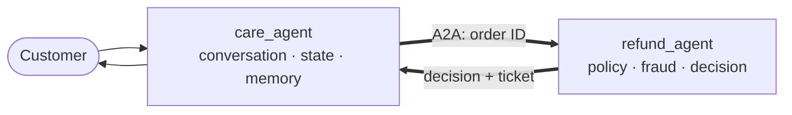

# Customer Care Multi-Agent System

This repository presents a production-minded customer-service system built with
**Google ADK** and **A2A**, and prototyped as **Claude Code skills** that migrate
**verbatim** into the ADK agents — policy is authored once and never rewritten in
Python. It demonstrates the design, runtime harness, governance, and evaluation of
a multi-agent system: a conversational coordinator delegates refund requests to an
independent specialist worker.

## 1. System overview



The coordinator owns the long-running conversation: intent, slot-filling, and
customer context. The worker is a stateless specialist with a fixed pipeline:

`order lookup → policy decision → fraud screen → customer response`

That separation is deliberate. The coordinator never makes refund decisions;
it delegates to the worker through a stable A2A interface.

## 2. Core capabilities

These three pages are where the engineering lives; the rest of this README is the
context that makes them land.

| Capability | What it shows |
|---|---|
| [Application-level harness — Cloud Run](docs/harness-cloud-run.md) | Two independent A2A/HTTPS services, each wiring **its own** PII guardrail, tracing, sessions, memory, and state. Makes concrete exactly what an application must own when the substrate is bare, portable compute. |
| [Platform-managed harness — Vertex Agent Engine](docs/harness-agent-platform.md) | The **same** worker deployed with `adk deploy` — the platform generates the container and provides sessions and tracing. The contrast sharpens one point: for a single agent the app can do everything; the platform's true exclusives are **cross-agent, org-scale** (registry, org-wide governance, multi-tenant identity). |
| [Evaluation loop — gate & flywheel](docs/eval-loop.md) | End-to-end audit on two axes — coordinator **trajectory** and worker **outcome**. The sharp idea: a golden-set match is an *assertion*, not a judge; an **LLM-as-judge** earns its place only where free text can hallucinate — proven by a case that flips **PASS → FAIL** only when the real model is switched on. Runs as a pre-deploy **gate** and a production **data flywheel**. |

## 3. Design principles

- **Policy is portable.** Customer-service policy lives in versioned `SKILL.md`
  files. The ADK agents bundle the same skill trees; Python contains only host
  wiring such as tools, state, memory, and A2A integration.
- **Responsibilities are assigned by role.** The coordinator handles PII first,
  session state, and memory. The worker remains short-lived and stateless, with
  defense-in-depth controls.
- **A2A is a contract.** The specialist is a black box behind an Agent Card,
  allowing each agent to evolve, scale, and deploy independently.
- **Evaluation follows the architecture.** The coordinator is judged on its
  path (did it route and delegate correctly?); the worker is judged on the
  decision and on whether the customer-facing reply is truthful.

## 4. Evidence of implementation

- Refund worker implemented as a four-stage `SequentialAgent` and deployed to
  Vertex Agent Engine.
- Coordinator implemented with session-state slot filling, local memory demos,
  and remote A2A delegation to the worker.
- Cloud Run deployment proves the two-agent A2A path over HTTPS.
- Local evaluation suite of eight scenarios with planted failures across
  delegation, policy outcome, and reply hallucination; the live LLM judge
  (`gemini-2.5-flash`) catches a subtle hallucination the offline check misses —
  verified end-to-end.

## 5. Repository map

```text
customer-care-agent/   coordinator: conversation, state, memory, A2A client
refund-agent/          specialist worker: policy, fraud screening, A2A server
docs/                  the three interview deep dives and deployment notes
eval/                  end-to-end dataset, trajectories, judge, and results
```

## 6. Run locally

Start the worker, then the coordinator:

```bash
# terminal 1
cd refund-agent/adk_refund
.venv/bin/uvicorn a2a_server:a2a_app --host localhost --port 8043

# terminal 2
cd customer-care-agent/adk_care
.venv/bin/adk web --port 8042 .
```

In the coordinator UI, try: `I want my money back`, then provide `order 67890`.
The coordinator collects the order ID and delegates to the refund specialist.

For the local evaluation suite:

```bash
python3 eval/run_eval.py
```

## 7. Current scope

The implemented system covers routing, A2A delegation, guardrails, tracing,
session/state, local memory demonstrations, deployment, and end-to-end
evaluation. Next steps are durable production persistence, distributed tracing
across the A2A hop, context management for long conversations, and a
human-in-the-loop production feedback loop.
