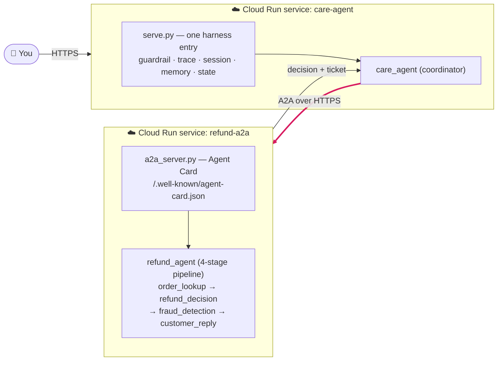

# Application-Level Harness & Governance — Cloud Run

*You compose the harness. Cloud Run gives you **bare compute** (a container that
scales) and nothing agent-specific. The application wires observability,
guardrails, sessions, memory, and state through ADK plus external managed services.
The agent remains portable; the application team owns the composition.*

This is **Way 1** of two. Contrast: [Way 2 — platform-managed on Agent
Engine](harness-agent-platform.md).

> **✅ Deployed & verified (us-central1) — two containers, real A2A over HTTPS:**
> - `refund-a2a`  → https://refund-a2a-51058313466.us-central1.run.app
> - `care-agent`  → https://care-agent-51058313466.us-central1.run.app
>
> Live check: care redacts a PII email (guardrail), delegates over A2A to the
> refund service, which runs its 4 stages on its own container and returns the
> decision (order 67890 → APPROVE; 12345 → ESCALATE).



*Two separate containers = two Cloud Run services = **real** A2A over HTTPS (not
an in-process call). Each service brings its own harness above the bare compute.*

---

## The principle

Cloud Run is a **substrate**, not an agent platform: it runs your container and
autoscales it — that's all. Every cross-cutting concern is therefore
**application-level** — its behavior lives in your code, while durable storage,
tracing, and other backends can be independent managed services. The agent can run
anywhere; the cost is that **you** own the wiring, correctness, persistence, and
end-to-end operating model.

Two agents = **two independent services** = **real A2A** over the network (not an
in-process call). Each is its own container with its own harness.

## Vibe-Coding Build Contract — Composable Runtime

Before asking a coding agent to generate ADK code, define the operating contract.
The existing `SKILL.md` files remain the source of domain and workflow knowledge;
the generated Python supplies the ADK runtime envelope around them.

| Concern | Decision the team must make |
| --- | --- |
| Agent shape | Which agents are short/stateless workers versus long-running coordinators? |
| Session / state | Which durable backend stores session events and business state? Define state keys, retention, and tenant scope. |
| Memory | Is cross-session memory needed? If yes, choose a retrieval/memory backend and define what may be written or retrieved. |
| Context | Which recent turns, summaries, state, retrieved memory, and tool results enter each model call? |
| Guardrails | What must be redacted, blocked, validated, or human-approved before model/tool actions? |
| Observability | Which trace backend, span fields, redaction rules, alerts, and evaluation signals are required? |
| Identity | Which service account, user/tenant identity, secret source, and tool permissions apply? |

### Prompt Template

```text
Build a production-oriented ADK application for deployment on Cloud Run.

1. Reuse the existing SKILL.md directories as the domain/workflow source of truth;
   load them through an ADK-compatible SkillToolset. Do not rewrite business policy.
2. Generate agent.py, tools.py, callbacks/guardrails.py, serve.py, Dockerfile,
   requirements, tests, and deployment configuration.
3. Implement these agent roles: [COORDINATOR / STATELESS WORKER].
4. Configure session/state through [SESSION BACKEND]. Persist only these state keys:
   [STATE KEYS]. Define retention and tenant/user scope.
5. Configure cross-session memory: [NONE / MEMORY BACKEND]. Allow only these memory
   categories: [ALLOWED MEMORY]. Retrieve memory only for [RETRIEVAL CONDITIONS].
6. Implement context strategy: recent history [N turns], older-history summarization
   [RULE], retrieved memory [RULE], tool-result inclusion [RULE].
7. Implement application-level guardrails: [PII/PHI redaction, tool allow-list,
   output validation, approval gates]. Do not place secrets in source code.
8. Export OpenTelemetry traces to [TRACE BACKEND], with sensitive fields redacted.
9. Use least-privilege IAM via [SERVICE ACCOUNT] and externalize all resource IDs
   and secrets as configuration.
10. Add unit, integration, and evaluation tests. A failed evaluation must block
    promotion. Produce a concise architecture README and list all assumptions.
```

Replace bracketed values with the client-specific decisions. Code generation can
scaffold the implementation; the engineering team must review service boundaries,
IAM, data handling, tool permissions, and evaluation evidence before deployment.

## One serve entry wires the whole harness

The load-bearing idea: each agent has a single **serve entry** that assembles the
harness around the agent and binds `0.0.0.0:$PORT`, so the *same file* runs
locally and in the container. Policy (`SKILL.md`) is never touched — operability
is bolted on around it.

**care — [`serve.py`](../customer-care-agent/adk_care/serve.py):**

```python
extra_plugins = ["guardrails.PIIRedactionPlugin"]          # governance: PII guardrail
app = get_fast_api_app(
    agents_dir=AGENTS_DIR, web=True, port=PORT,
    extra_plugins=extra_plugins,                            # guardrail hook
    trace_to_cloud=(TRACE_TO_CLOUD == "on"),               # observability
    # session_service_uri / memory_service_uri → durable backends on Cloud Run
)
uvicorn.run(app, host="0.0.0.0", port=PORT)
```

**refund — [`a2a_server.py`](../refund-agent/adk_refund/a2a_server.py):** wraps the
worker's `root_agent` with `to_a2a(...)`, binds `0.0.0.0:$PORT`, advertises the
public Agent Card URL via `A2A_PUBLIC_URL`, **and carries the same harness as the
playground** — the guardrail via a custom `Runner(plugins=[…])` that overrides
`to_a2a`'s bare default Runner, and tracing via the global OTel `TracerProvider`
configured before the app is built.

> **Why the harness must be re-attached here:** `to_a2a` builds its **own**
> Runner, and the harness lives on the Runner (guardrail plugins) and the process
> (OTel exporter). Switching serve entries = a new Runner, so the harness is
> re-wired on the entry you actually deploy. (Verified locally: the guardrail hook
> fires on every model call, and spans cover `invocation → invoke_agent … →
> call_llm → execute_tool`.)

## Per concern — how it's wired (accurate file pointers)

| Concern | Layer | How (application-level) | Where |
|---------|-------|-------------------------|-------|
| **Observability** | harness/gov | tracing via `trace_to_cloud` (care) / dual Cloud Trace + LangSmith (refund playground) | care [`serve.py`](../customer-care-agent/adk_care/serve.py) · refund [`serve_dual_trace.py`](../refund-agent/adk_refund/serve_dual_trace.py) · [doc 01](../refund-agent/adk_refund/docs/01-observability-tracing.md) |
| **Guardrail (PII)** | governance | ADK **Plugin** (`before_model` hook) redacts PII before every model call; registered via `extra_plugins` | care [`guardrails.py`](../customer-care-agent/adk_care/guardrails.py) · refund [`guardrails.py`](../refund-agent/adk_refund/guardrails.py) · [doc 02](../refund-agent/adk_refund/docs/02-governance-pii-guardrail.md) |
| **Memory** | harness | `MemoryService` + a `load_memory` tool (InMemory locally; `MEMORY_SERVICE_URI` for durable) | care [`agent.py`](../customer-care-agent/adk_care/care_agent/agent.py) · demo [`m3_memory_demo.py`](../customer-care-agent/adk_care/m3_memory_demo.py) |
| **Session / State** | harness | `SessionService` + `set_order_id`/`get_order_id` tools writing `tool_context.state` (slot-filling) | care [`agent.py`](../customer-care-agent/adk_care/care_agent/agent.py) · demo [`session_state_demo.py`](../customer-care-agent/adk_care/session_state_demo.py) |
| **A2A serve** | integration | `to_a2a(...)`, `0.0.0.0:$PORT`, public card via `A2A_PUBLIC_URL` | refund [`a2a_server.py`](../refund-agent/adk_refund/a2a_server.py) |
| **Deploy** | ops | container → Cloud Run, dev service account | [cheat sheet](deploy-cheatsheet.md) · [doc 03](../refund-agent/adk_refund/docs/03-cloud-run-deployment.md) |

## Assigned by role, not copied onto both

The harness is **distributed by role** — which is exactly what makes the
coordinator differ from the worker:

- **care (intake):** trace · **guardrail (first line — customer PII enters here)** ·
  **memory** · heavy **session/state**.
- **refund (worker):** the A2A endpoint · trace · guardrail (defense-in-depth).
  **No memory, minimal state** — it is short and stateless.

## Deploy it

Full commands in the [**cheat sheet**](deploy-cheatsheet.md). The shape:

1. **refund-a2a first** (care needs its URL): `gcloud run deploy --source .`
   → grab the URL → set `A2A_PUBLIC_URL` + Vertex env vars → redeploy env.
2. **care-agent**: `gcloud run deploy` with `REFUND_A2A_BASE_URL=<refund url>`,
   `TRACE_TO_CLOUD=on`, `PII_GUARDRAIL=on`.

## Gotchas we actually hit

| Symptom | Cause | Fix |
|---------|-------|-----|
| Agent Card advertised `localhost` | `to_a2a` bakes the card URL from host/port | set `A2A_PUBLIC_URL` to the public `*.run.app` |
| refund: *"No API key provided"* | its `.env` is dockerignored → container defaults to API-key mode | `GOOGLE_GENAI_USE_VERTEXAI=TRUE` (+ project/location) → uses the SA |
| `ModuleNotFoundError: a2a` | a2a extras not in the image | add `google-adk[a2a]` + `a2a-sdk[http-server]` to the Dockerfile |

## Stateless & multi-instance — externalize persistence

A Cloud Run container is **ephemeral** and may run as **many instances**, so
in-memory harness state does not survive across requests. When durability
matters, point the backend at a store — **no code change**:

| Concern | Local / demo | Cloud Run (durable) |
|---------|--------------|---------------------|
| Session / State | `InMemorySessionService` | `SESSION_SERVICE_URI` → a DB |
| Memory | `InMemoryMemoryService` | `MEMORY_SERVICE_URI` → a store |
| Worker data | in-memory dict | Firestore ([03.5](../refund-agent/adk_refund/docs/03.5-firestore-data-layer.md)) |

**"Swap the backend, not the concept."** The current deploy runs InMemory (fine
for a demo); the URIs are the one-line upgrade to durable.

## Still open (honest)

- **Distributed tracing across A2A** — each service now traces itself, but one
  request spans `care → A2A → refund`; to see it as a **single** end-to-end trace,
  the trace context must propagate across the hop so both services share a trace
  ID. This is the one concern that needs coordination *between* the two apps.
- **Persistence** is still InMemory on Cloud Run — fine for a demo, but session/
  memory won't survive across instances until `*_SERVICE_URI` point at a store.

## What this way demonstrates

You can read off **exactly what an agent platform provides** by listing what you
built here yourself: the serve entry, the guardrail plugin, the trace export, the
session/memory wiring, the A2A endpoint + its public-URL handling, and the
persistence to survive a stateless substrate. That list *is* the harness — and
[Way 2](harness-agent-platform.md) hands most of it to the platform.
