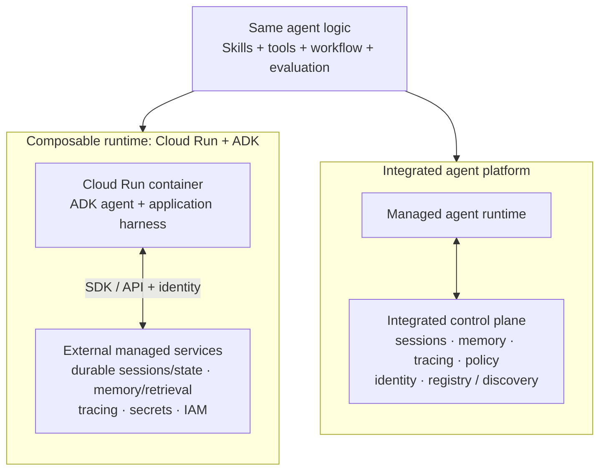

# Agent Harness Operating Models

The same agent logic can run in two mature operating models. This is an architecture decision, not a capability contest.

> **Shared agent logic:** Skills, tools, workflow/orchestration, evaluation, human controls, and domain policy remain application concerns in either model.

## The Responsibility Boundary

### Composable runtime

Cloud Run is a compute substrate. The application team chooses and wires the agent harness around the container: an ADK `SessionService` points to a durable session/state backend; a `MemoryService` points to a retrieval or memory backend; tracing exports to the selected backend; and application guardrails wrap model and tool calls.

This does **not** mean self-hosting every capability. The services are normally independent managed resources. The team owns their composition, identity propagation, integration tests, failure handling, and lifecycle.

### Integrated agent platform

An agent platform productizes much of that composition as a unified control plane. It can provide a managed runtime, sessions, memory, tracing, policy enforcement, identity, and agent discovery. This reduces operational wiring and improves organization-wide consistency.

Managed does **not** mean zero configuration. The team still configures resource scope, IAM, retention, policy, evaluation, data access, and the application's context strategy.

## Decision Guide

| Question | More likely: composable runtime | More likely: integrated agent platform |
| --- | --- | --- |
| Client has an established cloud stack or selected third-party components | Yes | No |
| Portability and component choice are strategic | Yes | No |
| Many agents need common identity, policy, registry, and audit controls | Harder to compose | Yes |
| Team can own integration and operating complexity | Yes | No |
| Fast, consistent enterprise governance is the primary need | No | Yes |

## FDE Principle

Start with the client's operating model, governance requirements, and existing platform strategy. Then select a composable runtime or an integrated agent platform; do not assume one deployment model is universally superior.
