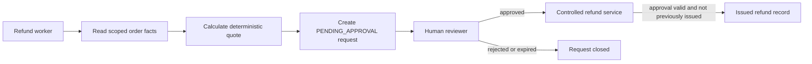

# Tool and Approval Boundaries for Refund Actions

## Purpose and status

This page describes a **local, runnable proof**, not a payment integration. It
extends the Customer Care prototype with one observable control: a refund worker
can prepare a refund request, but cannot cause a refund to be issued by itself.

The point is to separate what an LLM is asked to do from what the surrounding
application actually permits it to do. Prompts and skills guide the model;
deterministic service code enforces the high-consequence action.

## Three boundaries, one request path

| Boundary | Question | Example in this project |
|---|---|---|
| **Agent boundary** | Who owns the work? | The care coordinator delegates refund assessment to the refund worker through A2A. |
| **Tool boundary** | What may that agent do? | The worker receives narrowly scoped read, quote, and request-creation tools. |
| **Approval boundary** | When may a high-consequence action happen? | A refund is issued only after a valid reviewer approval and deterministic service checks. |

The agent boundary is primarily an orchestration concern. Tool and approval
boundaries are application-level harness and governance controls. They work for
one agent or many; multi-agent delegation is not required to enforce them.



## What is enforced, and where

The proof does not rely on the model agreeing with a prompt. The following
controls belong outside the model.

| Control | Enforcement point | Why it matters |
|---|---|---|
| Least-privilege tools | Agent configuration and tool wrapper | The coordinator has no refund tools; the refund worker has only the minimum tools required for assessment and request creation. |
| Typed contracts | Tool/service request and response models | High-risk calls use explicit fields rather than free-form text. |
| Deterministic policy | Refund service | Eligibility and quote rules are code, not an LLM decision. |
| Reviewer authorization | Approval service | The reviewer identity comes from a trusted execution context, not a model-supplied role string. |
| Approval state | Persistent request and approval records | Issuance requires an approved, unexpired record for the same request. |
| Idempotency | Transaction or unique record keyed by request | A retry returns the original result rather than creating a second refund. |
| Audit record | Append-only event log | The system records the request, approval, issuance outcome, identities, timestamp, and trace ID. |

An ADK tool list is an important first layer, but it is not sufficient on its
own. A service must independently validate its inputs and state, so a direct or
unexpected call cannot bypass the intended control flow.

## Minimal local proof

The implementation lives in `refund-agent/adk_refund/refund_agent/` and needs
no payment provider or cloud credentials. An in-memory repository with
synthetic records makes the control flow observable and testable.

1. The worker reads a synthetic order and receives a deterministic quote.
2. It creates one `PENDING_APPROVAL` request using a stable idempotency key.
3. An issuance attempt before approval is rejected without creating a refund.
4. An authorized synthetic reviewer approves the request.
5. The controlled service records one issued refund.
6. A repeated issuance attempt returns the original result and creates no second refund.
7. The audit log shows the request, approval, issuance, identities, and trace ID.

This proves a control flow, not a complete payment system. It intentionally
excludes real money movement, credentials, a customer-management UI, and a
production role-management system.

Run the proof locally:

```bash
cd refund-agent/adk_refund
python3 -m unittest discover -s tests -v
```

The three tests prove pre-approval rejection, approved issuance, and safe
duplicate-call handling. They exercise the deterministic service directly; the
next integration step would expose its request-creation operation through an
ADK tool wrapper without changing the control logic.

## Suggested implementation shape

```text
refund_agent/
  agent.py                  assigns only the needed tool capabilities
  tools.py                  thin typed wrappers around service operations
  contracts.py              request, response, and status models
  refund_service.py         quote, request, approval, and issuance checks
  audit.py                  append-only synthetic audit events
  tests/test_tool_boundary.py
```

The service owns the state transition:

```text
PENDING_APPROVAL → APPROVED → ISSUED
```

Only a trusted reviewer operation may create `APPROVED`; only the controlled
service may create `ISSUED`. The model may request work, but it does not own
these state transitions.

## Design summary

> Skills define intended behavior; tool and approval boundaries enforce permitted behavior. The coordinator owns customer interaction, the refund worker owns assessment, and deterministic service code owns the decision to record a high-consequence refund action.

## Implemented proof

- [x] Typed service contracts
- [x] Deterministic quote calculation
- [x] Pending-request and reviewer-approval states
- [x] Idempotent issuance path
- [x] Append-only audit events
- [x] Tests for pre-approval rejection, approved issuance, and duplicate-call safety
